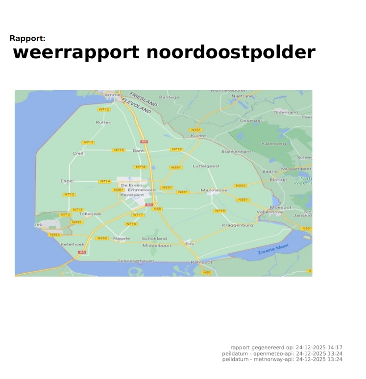

### Weerdata: Noordoostpolder

In dit eindproject ga ik weerdata gebruiken om specifiek voor de dorpen in de Noordoostpolder een aantal vragen te beantwoorden. 
Deze vragen worden beantwoord door gebruik te maken van 6 visuals in de analyse notebook. 
De weerdata wordt uit 2 verschillende APIs opgehaald: OpenMeteo en Met Norway. 
Als laatste stap kan er een pdf-rapport gegeneeerd worden welke automatisch wordt opgeslagen.

### Quickguide:

- Zet de bestanden in een projectmap

- Open de projectmap in VS Code en zorgt dat de venv geactiveerd is.

- Installeer de dependecies uit het requirements tekstbestand via de terminal.

- Run de verzamelen-notebook.

- Run de analyse-notebook.

Klaar! Het weer-rapport met analyse staat in de submap *rapport* in de projectmap.

